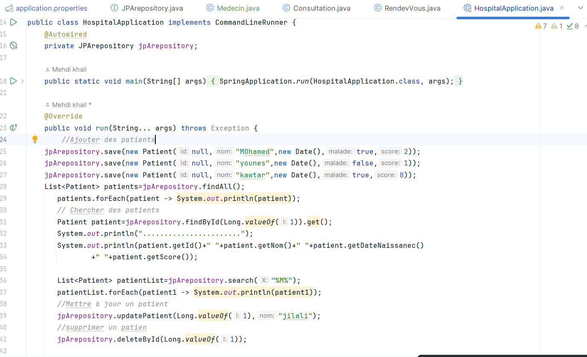

<h1>Activité Pratique N°2 - ORM, JPA Hibernate Spring Data</h1>

1-Créer l'entité JPA Patient ayant les attributs :

2-Configurer l'unité de persistance dans le ficher application.properties 

3-Créer l'interface JPA Repository basée sur Spring data :

4-Tester quelques opérations de gestion de patients :

<ul>
  <li>Ajouter des patients</li>
  <li>Consulter tous les patients</li>
  <li>Chercher des patients</li>
  <li>Mettre à jour un patient</li>
  <li>supprimer un patient</li>
  
  </ul>
  
Base donne de type H2 :

Base donne de type mySql  :

